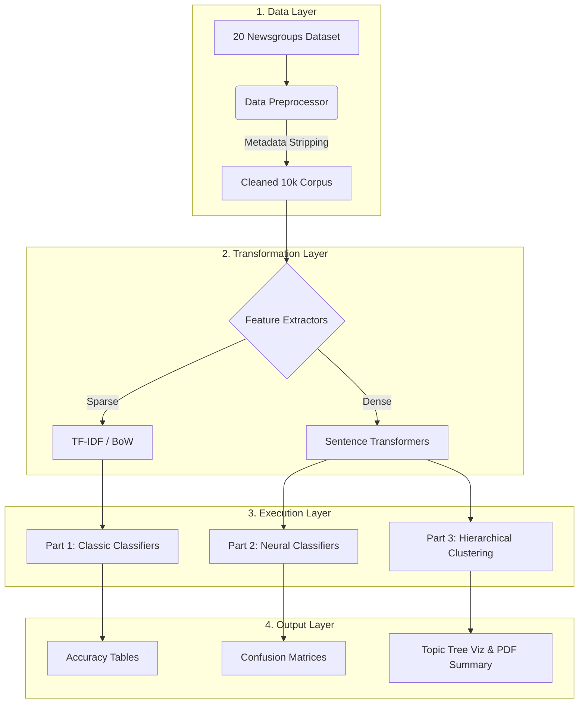
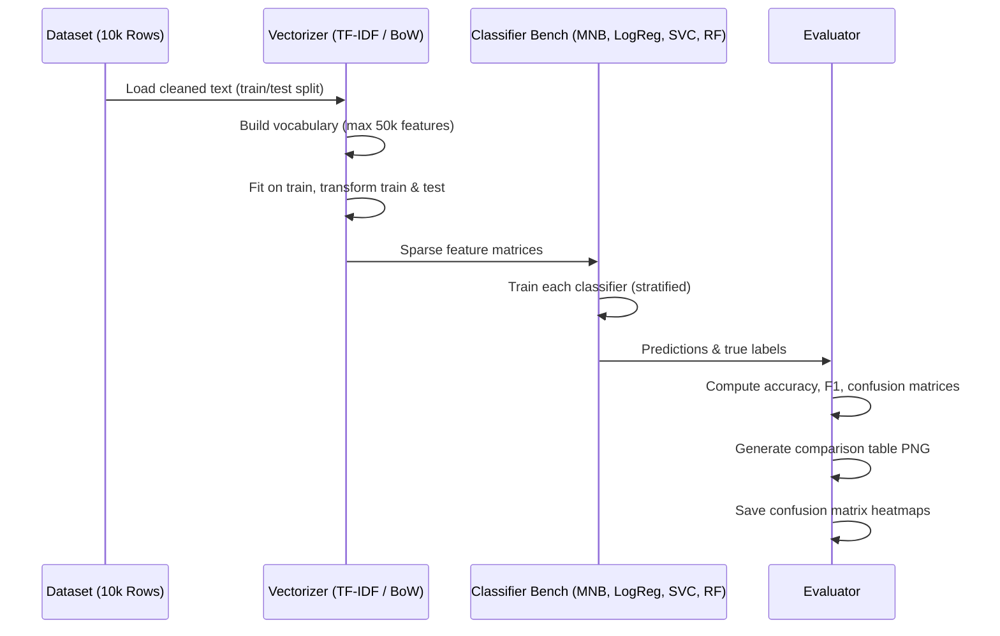
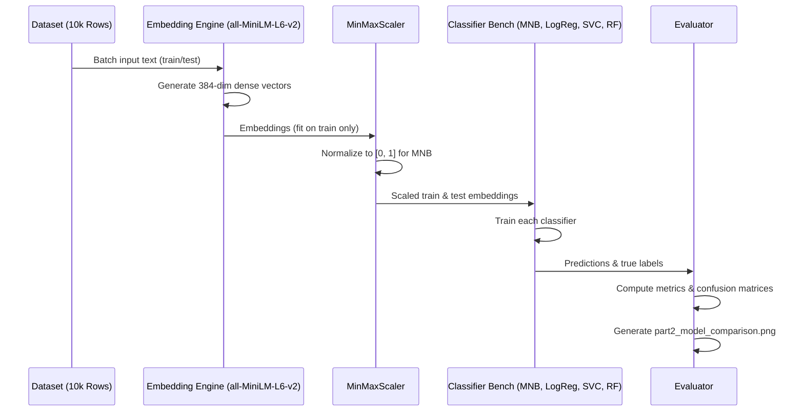
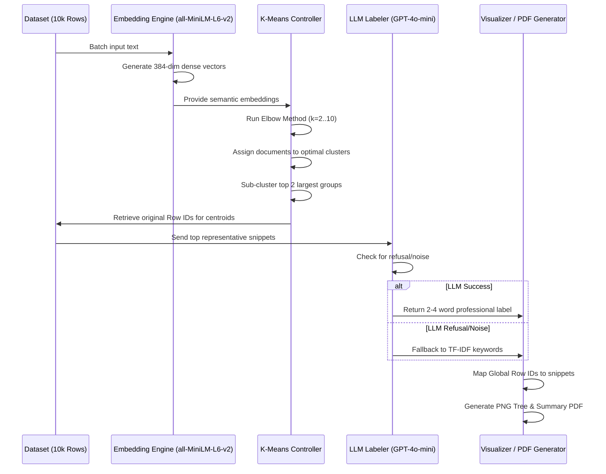

# 🏗 Project Architecture: Hierarchical NLP Pipeline

This document details the architectural design and technical flow of the NLP Topic Tree project. The system is built on a modular, multi-stage architecture that transitions from supervised classification to unsupervised hierarchical discovery.

---

## 🛰 System Overview

The project is structured into three distinct functional layers: **Data Ingestion**, **Model Benchmarking**, and **Hierarchical Synthesis**.



---

## 🔄 Document Processing Sequences

### Part 1: Classic ML Classification

The following sequence diagram illustrates the lifecycle of documents through the classic ML pipeline—from raw text to sparse vectorization, classifier benchmarking, and evaluation outputs.



---

### Part 2: Neural Embedding Classification

The following sequence diagram illustrates the lifecycle of documents through the neural embedding pipeline—dense vectorization, scaling for MNB compatibility, and classifier evaluation.



---

### Part 3: Hierarchical Discovery & Labeling

The following sequence diagram illustrates the lifecycle of a document as it moves through the unsupervised discovery and labeling phase.



---

## 🛠 Component Specifications

### 1. Data Preprocessing (`src/data.py`)

- **Sampling**: Restricts processing to a 10,000-document subset to maintain computational efficiency while ensuring statistical significance.
- **Sanitization**: Specifically removes headers, footers, and quotes to ensure models learn semantic content rather than metadata patterns.
- **Splitting**: Implements stratified sampling to maintain class balance across training and testing sets.

### 2. Classification Engines

- **Classic ML** (`src/part1_classic.py`): Utilizes scikit-learn pipelines to compare four distinct mathematical approaches to text classification.
- **Neural ML** (`src/part2_embeddings.py`): Uses the **all-MiniLM-L6-v2** model to transform text into 384-dimensional semantic space.
- **Scaling Logic**: Implements **MinMaxScaler** for neural embeddings to support the mathematical requirements of the Multinomial Naive Bayes classifier.

### 3. Hierarchical Discovery (`src/part3_clustering.py`)

- **Unsupervised Learning**: Employs K-Means clustering where the optimal number of clusters is determined dynamically via the Elbow Method (Inertia vs. K).
- **Recursive Depth**: Identifies the two largest clusters and performs secondary sub-clustering to uncover granular sub-topics.
- **Label Synthesis**: Integrates a "Refusal-Aware" OpenAI labeler that translates document snippets into professional topic labels with a TF-IDF keyword fallback for noisy data.

---

## 🔄 Data Integrity & Mapping

A core architectural requirement is the **Global Row ID Mapping**.

- **Traceability**: Every document maintains its original index (0–9999) throughout the pipeline.
- **Verification**: The final `cluster_summary.pdf` maps clusters back to these global row numbers, allowing for 1:1 data audits.
- **Serialization**: All numerical outputs are cast from `numpy.int64` to standard Python integers to ensure 100% JSON compatibility.

---

## 📁 Directory Structure

```
├── .venv/                  # Virtual environment (library root)
├── scripts/
│   ├── outputs/            # PNGs, PDFs, and JSON results
│   ├── demo_data_viewer.py # Data inspection utility
│   ├── run_part1.py        # Classic ML runner
│   ├── run_part2.py        # Embedding ML runner
│   └── run_part3.py        # Clustering & PDF runner
├── src/
│   ├── config.py           # Configuration & constants
│   ├── data.py             # Data loading & metadata stripping
│   ├── eval.py             # Metric calculation & plotting
│   ├── llm_labeler.py      # OpenAI integration & fallback logic
│   ├── part1_classic.py    # BoW/TF-IDF & classic classifiers
│   ├── part2_embeddings.py # Sentence transformers & embedding classifiers
│   ├── part3_clustering.py # K-Means & tree visualization
│   └── utils.py            # Shared utilities
├── .env                    # OPENAI_API_KEY (optional, for Part 3 labeling)
└── requirements.txt        # Python dependencies
```
