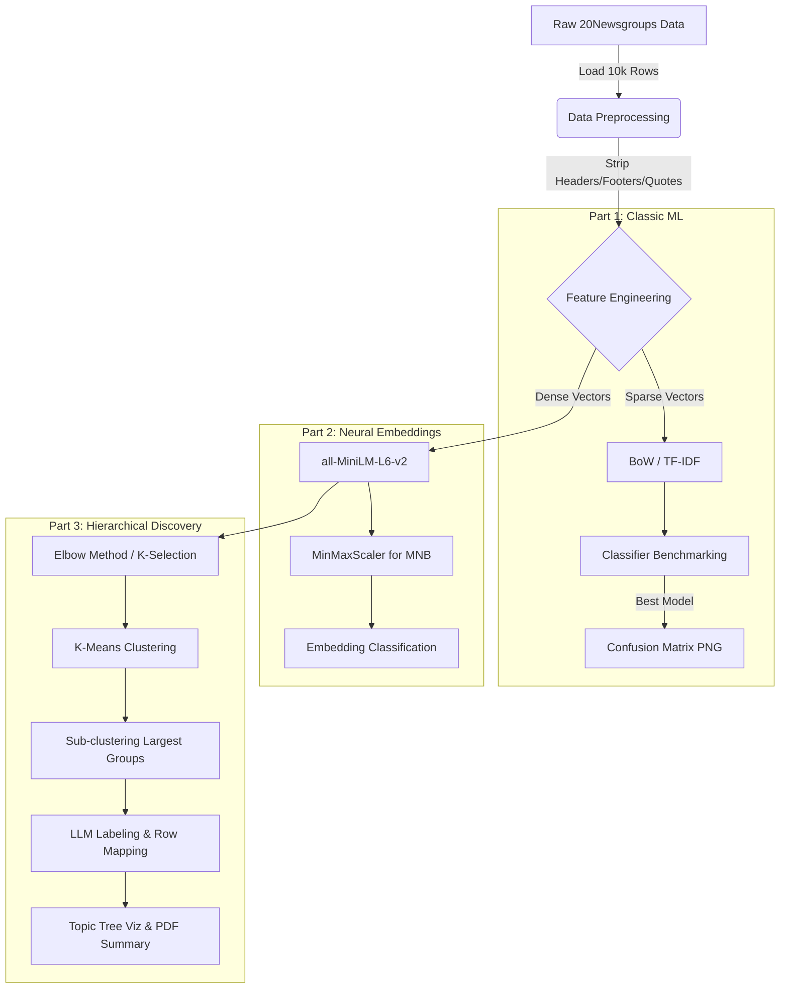

# 🌲 NLP Topic Tree & Multi-Stage Classification Pipeline

A professional, end-to-end NLP system developed for the analysis and organization of the **20 Newsgroups** dataset. This project implements a rigorous pipeline that compares classic statistical methods with modern transformer-based embeddings, concluding with an unsupervised hierarchical clustering model and an automated topic-labeling system.

---

## 🏗 Data Pipeline Visualization

The following diagram illustrates the flow of data from raw ingestion to the final hierarchical report:



---

## 🏛 Project Architecture

The pipeline is designed for high reproducibility and modularity, strictly adhering to a 10,000-document processing cap with metadata stripping to ensure classification integrity.

- **Data Ingestion** (`src/data.py`): Loads 10,000 rows and removes headers, footers, and quotes to prevent "metadata cheating" during classification.
- **Classic ML Pipeline (Part 1)**: Tests Bag-of-Words (BoW) and TF-IDF feature sets across four classifiers: MultinomialNB, Logistic Regression, Linear SVC, and Random Forest.
- **Neural Embedding Pipeline (Part 2)**: Leverages the **all-MiniLM-L6-v2** transformer to generate 384-dimensional dense semantic vectors.
- **Hierarchical Discovery (Part 3)**: Utilizes K-Means and the Elbow Method to discover global clusters, performs sub-clustering on high-density groups, and generates human-readable labels via OpenAI's **gpt-4o-mini**.

---

## 🛠 Technical Implementation Details

### 1. Classification & Evaluation

- **Vectorization**: Implements sparse TF-IDF and BoW with a 50,000-feature vocabulary limit.
- **Embedding Scaling**: Neural embeddings are normalized using a **MinMaxScaler** fitted exclusively on training data to support MultinomialNB.
- **Performance Tracking**: Automatically generates confusion matrix heatmaps and high-resolution comparison tables for all model iterations.

### 2. Hierarchical Clustering & Labeling

- **Optimal K Selection**: Automatically determines the best cluster count using the Elbow Method (Inertia vs. K).
- **Sub-clustering**: The two largest identified clusters are automatically re-clustered into 3 sub-topics to uncover granular categories.
- **LLM Topic Synthesis**: A custom "refusal-aware" labeler uses OpenAI to synthesize document snippets into 2–4 word professional labels.
- **Sanitization**: If LLM snippets are noisy or the model refuses to label, the system falls back to a TF-IDF keyword extraction method to ensure consistent labeling (e.g., "Data Analysis Techniques").

### 3. Global Row Mapping & Row ID Persistence

- **Traceability**: All cluster summaries maintain a direct link to the original dataset indices (0–9999).
- **PDF Formatting**: The cluster summary report displays each document as `Doc at Row #X: [Snippet]`, facilitating 1:1 validation with the raw dataset.

---

## 📊 Visual Outputs & Reports

The system populates an `/outputs` directory with the following assets for each run:

| File | Description |
|------|-------------|
| `part1_model_comparison.png` | High-resolution table comparing classic ML metrics |
| `part2_model_comparison.png` | Performance table for embedding-based models |
| `topic_tree_viz.png` | Hierarchical diagram with expanded axis limits and wider figure sizes to prevent label overlap |
| `elbow_plot.png` | Visualization of the mathematical "bend" used for cluster selection |
| `cluster_summary.pdf` | A formal report mapping discovered clusters to specific document row numbers and content snippets |

---

## 📦 Getting Started

### 1. Installation

```bash
# Create and activate virtual environment
python -m venv .venv
source .venv/bin/activate   # Windows: .venv\Scripts\activate

# Install dependencies
pip install numpy scikit-learn matplotlib sentence-transformers openai python-dotenv pandas
```

### 2. Configuration

Create a `.env` file in the project root to enable LLM-powered labeling:

```
OPENAI_API_KEY=your_actual_key_here
```

### 3. Running the Pipeline

```bash
# Execute Part 1, 2, and 3 in sequence
python -m scripts.run_part1
python -m scripts.run_part2
python -m scripts.run_part3
```

---

## 🔬 Reproducibility & Constraints

- **Global Seed**: All stochastic processes (K-Means, RandomForest, Train/Test splits) are locked to **Seed 42**.
- **JSON Serializability**: To avoid `TypeError: Object of type int64 is not JSON serializable`, all indices are explicitly cast to standard Python integers before file export.
